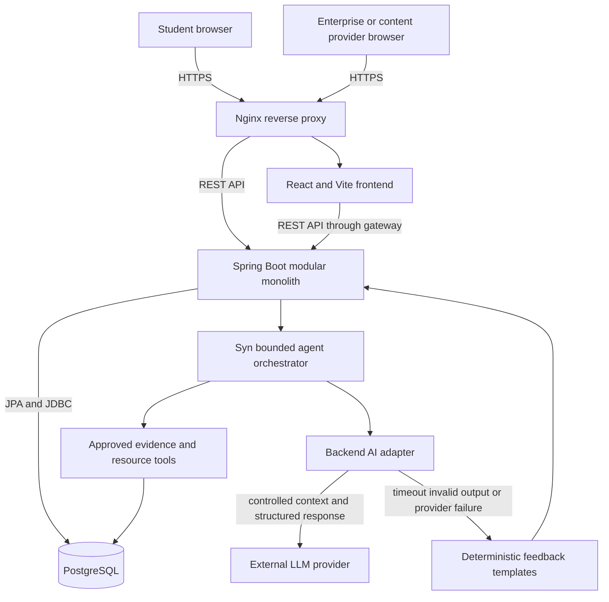

# System architecture

The MVP is a modular monolith deployed as separate frontend, backend, database, and reverse-proxy containers. The external LLM is an optional provider behind a backend-owned interface. PostgreSQL remains the only source of application data, and the LLM never receives direct database access.

## Backend modules

| Module | Responsibility | Current state |
|---|---|---|
| `identity` | Authentication, roles, profiles, consent | Account/consent read boundary exists; runtime login remains pending |
| `assessment` | RIASEC questionnaire and deterministic scoring | Preliminary US-01 backend implemented |
| `catalog` | Published simulation discovery | Working foundation slice |
| `simulation` | Tasks, attempts, submissions, deterministic evaluation | Preliminary US-02 backend implemented |
| `guidance` | Dashboard summaries, bounded session memory, deterministic intent/tool routing, Syn provider adapter, schema validation, and Standard fallback | US-03 bounded agent and global Syn widget implemented; runtime login remains pending |
| `enterprise` | Simulation authoring, publishing, and monitoring | Boundary reserved |
| `common` | Narrow cross-cutting API/configuration/error primitives | Working foundation |
| `system` | Health and operational endpoints | Working foundation |

Each module exposes a service interface as its application facade. Controllers depend on that interface, while implementation classes hide DAOs, entities, mappers, integrations, and transaction boundaries.

## Syn agent boundary

Syn is an orchestrated single-agent workflow, not an unrestricted autonomous agent.
`SynAgentPolicy` chooses from a fixed tool allowlist; `SynAgentToolbox` executes
owned-data reads and prepares display artifacts; `SynAgentOrchestrator` loads bounded
memory, permits at most one optional provider call, updates structured memory, and
returns provenance. Gemini phrases eligible free-text answers, but it cannot choose
SQL, call a URL, change evidence, or persist a plan. Explicit plan confirmation
remains a separate service use case.

The policy also resolves `AUTO`/English/Vietnamese language, common Vietnamese
shorthand, exploration stage, and a bounded response depth. With no personal
evidence, the toolbox supplies reviewed catalog/path knowledge for honest onboarding
instead of pretending to personalize. Session memory stores compact codes rather
than raw dialogue. The frontend progressively reveals only the already validated
reply, anchors the submitted question, and leaves scrolling under student control;
this is deliberately not unvalidated provider-token streaming.

## Deployment correspondence

The root `docker-compose.yml` implements the architecture as four local services:

1. `gateway` routes browser traffic.
2. `frontend` serves the React build.
3. `backend` executes business rules and integrations.
4. `postgres` stores durable application data in a named volume.

The source architecture image is retained in `.agent/references/system-architecture.png`. This Mermaid diagram must be updated when the deployed topology changes.
