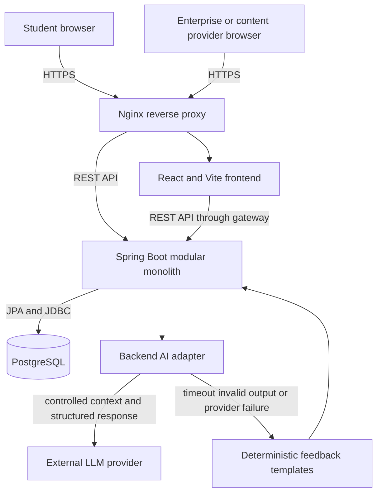

# System architecture

The MVP is a modular monolith deployed as separate frontend, backend, database, and reverse-proxy containers. The external LLM is an optional provider behind a backend-owned interface. PostgreSQL remains the only source of application data, and the LLM never receives direct database access.

## Backend modules

| Module | Responsibility | Current state |
|---|---|---|
| `identity` | Authentication, roles, profiles, consent | Boundary reserved |
| `assessment` | RIASEC questionnaire and deterministic scoring | Boundary reserved for US-01 |
| `catalog` | Published simulation discovery | Working foundation slice |
| `simulation` | Tasks, attempts, submissions, deterministic evaluation | Boundary reserved for US-02 |
| `guidance` | Dashboard summaries, controlled evidence context, Syn adapter, schema validation, and Standard fallback | Frontend contract implemented; backend boundary reserved for US-03 |
| `enterprise` | Simulation authoring, publishing, and monitoring | Boundary reserved |
| `common` | Narrow cross-cutting API/configuration/error primitives | Working foundation |
| `system` | Health and operational endpoints | Working foundation |

Each module exposes a service interface as its application facade. Controllers depend on that interface, while implementation classes hide DAOs, entities, mappers, integrations, and transaction boundaries.

## Deployment correspondence

The root `docker-compose.yml` implements the architecture as four local services:

1. `gateway` routes browser traffic.
2. `frontend` serves the React build.
3. `backend` executes business rules and integrations.
4. `postgres` stores durable application data in a named volume.

The source architecture image is retained in `.agent/references/system-architecture.png`. This Mermaid diagram must be updated when the deployed topology changes.
