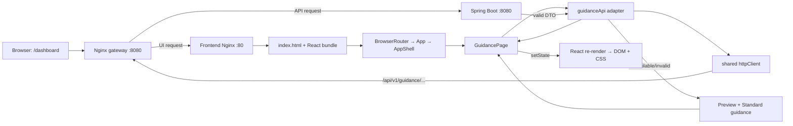
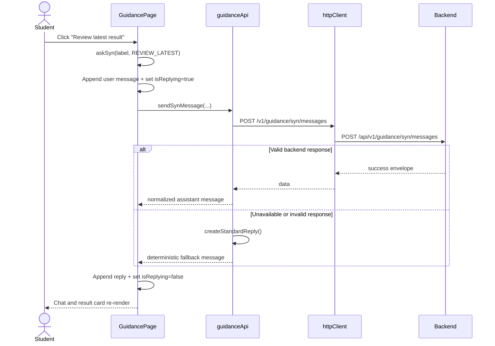

# Kịch bản trình bày frontend US-03: Dashboard và Syn

Tài liệu này giúp người phụ trách US-03 hiểu và tự giải thích frontend từ kiến trúc tổng thể đến từng khối code. Số dòng dựa trên phiên bản ngày 2026-09-11; nếu code thay đổi, hãy tìm theo tên hàm hoặc CSS selector được ghi kèm.

## 1. Câu mô tả ngắn nhất

US-03 cung cấp một Dashboard tóm tắt dữ liệu khám phá nghề nghiệp và một trợ lý tên Syn để giải thích evidence, mở result detail ngay trong chat và soạn next-step plan. Syn chỉ hỗ trợ diễn giải; điểm số vẫn đến từ đánh giá deterministic và quyết định cuối cùng vẫn thuộc về sinh viên.

## 2. Phạm vi cần nói rõ

Frontend hiện có:

- Dashboard: progress, top RIASEC signals, skills practised, latest simulation result và current plan.
- Syn chat: lời chào, quick actions, free-text input, loading state và error recovery.
- Structured cards: result detail, evidence status, suggested follow-up và plan draft.
- Confirmation: người dùng phải xem lại plan draft trước khi lưu.
- Provenance: phản hồi luôn được gắn `AI-assisted` hoặc `Standard guidance`.
- Fallback: nếu backend/AI chưa sẵn sàng, hệ thống dùng preview data và deterministic Standard guidance.
- Responsive và accessibility: semantic elements, labels, ARIA states, keyboard controls và các breakpoint 980/860/560 px.

Frontend hiện chưa có:

- Authentication và dữ liệu thật theo từng sinh viên.
- Backend cho ba endpoint US-03.
- LLM provider, RAG/vector database, tool calling hoặc long-running autonomous agent.
- Lưu plan thật vào database.
- Chứng nhận kỹ năng, dự đoán nghề nghiệp hoặc thay đổi điểm số.

## 3. Kiến trúc tổng thể



Nguyên tắc phân lớp:

| Lớp | Trách nhiệm | Không nên làm |
|---|---|---|
| Page/controller | Giữ UI state, nhận interaction, chọn nội dung render | Tự viết `fetch`, tự hiểu HTTP envelope |
| API adapter | Định nghĩa contract US-03, normalize dữ liệu, chọn fallback | Render JSX hoặc sửa DOM |
| Shared HTTP client | Ghép base URL, gửi request, parse envelope, chuẩn hóa HTTP error | Biết Dashboard/Syn là gì |
| Presentational helpers | Render message, badge, result card, empty state | Gọi backend hoặc giữ global state |
| CSS | Hierarchy, spacing, responsive và interaction presentation | Quyết định business rule |

## 4. Đường đi từ request đến giao diện

### 4.1 Người dùng mở `/dashboard`

1. Browser gửi `GET http://localhost:8080/dashboard`.
2. `deployment/nginx/default.conf` nhận request tại gateway.
3. Vì URL không bắt đầu bằng `/api/`, gateway chuyển request đến frontend container.
4. `frontend/nginx.conf` dùng `try_files ... /index.html`, nên route SPA như `/dashboard` vẫn nhận `index.html` thay vì 404.
5. Browser tải JavaScript/CSS bundle do Vite build.
6. `main.jsx` mount React vào `<div id="root">` và bật `BrowserRouter`.
7. `App.jsx` khớp route `dashboard` với `GuidancePage`.
8. `AppShell` render header/footer và đặt `GuidancePage` vào `<Outlet />`.
9. Lần render đầu, `dashboard === null`, nên page hiển thị loading state.
10. `useEffect` gọi `getExplorationDashboard()` đúng một lần sau khi component mount.
11. Adapter gọi `apiRequest('/v1/guidance/dashboard')`.
12. Shared HTTP client ghép thành `/api/v1/guidance/dashboard`.
13. Nếu backend trả DTO hợp lệ, adapter normalize rồi page gọi `setDashboard(data)`.
14. Nếu backend trả 401/403/404/5xx hoặc không kết nối, adapter trả `previewDashboard`.
15. `setDashboard` làm React re-render. Loading biến mất và Dashboard cards xuất hiện.

Hiện tại backend chưa mở endpoint US-03 nên trả 403. Đây là lý do giao diện có banner `Preview data` và Syn hiển thị `Standard mode`; đây là hành vi có chủ đích, không phải lỗi render.

### 4.2 Người dùng chọn một quick action



Điểm quan trọng: `REVIEW_LATEST` không yêu cầu Syn tính điểm. Adapter chỉ lấy nguyên `latestResult.score` đã có trong Dashboard và đưa vào `ResultCard`.

### 4.3 Người dùng nhập câu hỏi tự do

1. `textarea` là controlled input: giá trị luôn lấy từ state `draft`.
2. `onChange` cập nhật `draft` sau mỗi lần gõ.
3. Submit form gọi `event.preventDefault()` để browser không reload trang.
4. `askSyn(draft)` dùng action mặc định `FREE_TEXT`.
5. Backend tương lai có thể trả AI response có cấu trúc.
6. Trong Standard mode, adapter nhận diện các keyword `plan`, `result`, `score`, `riasec`, `interest` và chọn template phù hợp.
7. Nếu không nhận diện được, Syn trả câu hướng dẫn phạm vi câu hỏi có thể hỗ trợ.

### 4.4 Luồng tạo và lưu plan

1. Quick action `DRAFT_PLAN` tạo response có trường `planDraft`.
2. `SynMessage` thấy `message.planDraft` nên render plan card.
3. Bấm `Review before saving` chỉ gọi `setPendingPlan(planDraft)`; chưa có POST.
4. Khi `pendingPlan` có giá trị, confirmation section mới xuất hiện.
5. `Keep editing` đặt `pendingPlan` về `null`.
6. `Confirm and save` gọi `saveExplorationPlan(pendingPlan)`.
7. Nếu backend hoạt động, POST plan và báo đã lưu.
8. Nếu đang preview, adapter trả `{ saved: false, preview: true }` và UI nói rõ không có dữ liệu nào được ghi.

## 5. API contract frontend đang chờ backend

### Dashboard

```http
GET /api/v1/guidance/dashboard
```

```json
{
  "success": true,
  "data": {
    "source": "LIVE",
    "studentName": "Student",
    "progress": { "completed": 2, "total": 3 },
    "interestSignals": [
      { "code": "I", "label": "Investigative", "score": 18 }
    ],
    "skills": [
      { "name": "API response analysis", "status": "OBSERVED_STRENGTH" }
    ],
    "recentResults": [
      {
        "id": "attempt-1",
        "title": "Backend API Triage",
        "score": 80,
        "outcomes": []
      }
    ],
    "plan": null
  }
}
```

### Syn message

```http
POST /api/v1/guidance/syn/messages
Content-Type: application/json
```

```json
{
  "message": "Review my latest result",
  "actionType": "REVIEW_LATEST",
  "context": { "attemptId": "attempt-1" }
}
```

```json
{
  "success": true,
  "data": {
    "id": "message-1",
    "text": "Evidence-grounded response.",
    "provenance": "AI",
    "resultCard": null,
    "suggestions": [],
    "planDraft": null
  }
}
```

### Save plan

```http
POST /api/v1/guidance/plans
Content-Type: application/json
```

Backend phải lấy student identity từ authenticated context. Frontend không gửi hard-coded student ID.

## 6. Bản đồ file liên quan

| File | Vai trò trong US-03 |
|---|---|
| `frontend/src/main.jsx` | Khởi động React, BrowserRouter và global CSS |
| `frontend/src/app/App.jsx` | Khai báo `/dashboard` và compatibility route `/guidance` |
| `frontend/src/shared/layout/AppShell.jsx` | Thêm Dashboard vào navigation và render route con qua Outlet |
| `frontend/src/features/guidance/pages/GuidancePage.jsx` | UI controller và toàn bộ view của Dashboard/Syn |
| `frontend/src/features/guidance/api/guidanceApi.js` | DTO shape, adapter, normalization, Standard fallback và ba API operations |
| `frontend/src/shared/api/httpClient.js` | `fetch`, base URL, JSON envelope và `ApiError` |
| `frontend/src/features/guidance/api/guidanceApi.test.js` | Kiểm thử decision boundaries của adapter |
| `frontend/src/styles/index.css` | Style US-03 từ selector `.us03-page`; responsive nằm ở các media query cuối file |
| `frontend/vite.config.js` | Dev server và proxy `/api` sang backend port 8081 |
| `frontend/nginx.conf` | Serve SPA build và fallback mọi UI route về `index.html` |
| `deployment/nginx/default.conf` | Gateway port 8080, tách `/api/` sang backend và `/` sang frontend |
| `docker-compose.yml` | Ghép PostgreSQL, backend, frontend và gateway thành local stack |

## 7. Kiến thức cần nắm trước khi đọc code

### JavaScript hiện đại

- `const` tạo binding không gán lại; `let` dùng khi giá trị cần thay đổi.
- `async/await` viết luồng Promise giống code tuần tự.
- `try/catch/finally`: success, error và cleanup luôn chạy.
- `?.` là optional chaining, tránh lỗi khi phần bên trái là `null/undefined`.
- `??` lấy giá trị bên phải chỉ khi bên trái là `null/undefined`.
- `condition ? a : b` là ternary expression.
- `...object` hoặc `...array` là spread syntax để sao chép/gộp dữ liệu bất biến.
- `.map()` biến mỗi item thành JSX; `.find()` tìm item đầu tiên thỏa điều kiện.
- `Array.isArray()` kiểm tra dữ liệu backend trước khi UI dùng `.map()`.
- Template literal dùng dấu backtick và `${expression}` để chèn giá trị.

### React

- Functional component là hàm trả về JSX.
- Props là input từ component cha; state là dữ liệu nội bộ có thể thay đổi.
- `useState(initialValue)` trả về `[value, setter]`.
- Gọi setter tạo render mới; không sửa trực tiếp array/object state.
- `useEffect(..., [])` chạy side effect sau lần mount đầu tiên.
- Cleanup của effect ngăn request cũ cập nhật component đã unmount.
- Controlled input dùng `value={state}` và `onChange={...setState}`.
- Conditional rendering dùng `&&`, ternary hoặc return sớm.
- `key` giúp React nhận diện ổn định các item trong list.

### Router và SPA

- `BrowserRouter` dùng History API để URL thay đổi mà không tải lại toàn bộ document.
- `Route` ánh xạ URL sang component.
- `Link/NavLink` điều hướng client-side.
- `Outlet` là vị trí route con được render trong layout chung.
- Nginx `try_files ... /index.html` là điều kiện để refresh trực tiếp `/dashboard` không bị 404.

### CSS

- CSS Grid dùng cho bố cục Dashboard/Syn và card grid hai cột.
- Flexbox dùng cho heading, badges, list row và buttons.
- BEM-like class như `.syn-panel__header` mô tả element thuộc block; `--standard` mô tả variant.
- `minmax(0, 1fr)` cho phép cột co đúng cách, tránh text tạo horizontal overflow.
- `position: sticky` giữ Syn trong viewport trên desktop.
- Media query chuyển hai cột thành một cột và mở mobile navigation.
- `:focus-visible`, semantic HTML và ARIA hỗ trợ keyboard/screen reader.

## 8. Walkthrough theo file và dòng

### 8.1 `frontend/src/main.jsx` — dòng 1–13

| Dòng | Giải thích |
|---|---|
| 1 | Import `StrictMode`; development mode giúp phát hiện side effect không an toàn. |
| 2 | Import `createRoot`, API mount React 18/19. |
| 3 | Import `BrowserRouter` để route hoạt động trong browser. |
| 4 | Import root component `App`. |
| 5 | Import global design tokens và CSS cho mọi feature. |
| 7 | Tìm DOM node có id `root` từ `index.html` và tạo React root. |
| 8–12 | Bọc App trong StrictMode và BrowserRouter rồi render. |

Kịch bản nói: “Đây là entry point. Browser chỉ nhận một `index.html`; từ đây React tiếp quản việc render và routing.”

### 8.2 `frontend/src/app/App.jsx` — dòng 1–29

| Dòng | Giải thích |
|---|---|
| 1 | Import router primitives. |
| 2–8 | Import layout và các page của từng user story. |
| 12 | `Routes` chọn route phù hợp nhất với URL hiện tại. |
| 13 | Parent route không có path dùng `AppShell` làm layout chung. |
| 14–21 | Routes landing, assessment và simulation; phần này thuộc shared integration/US-01/US-02. |
| 22 | `/dashboard` render `GuidancePage`, route chính của US-03. |
| 23 | `/guidance` render cùng page để giữ compatibility với link cũ. |
| 29 | Export để `main.jsx` sử dụng. |

### 8.3 `frontend/src/shared/layout/AppShell.jsx` — dòng 1–81

Phần US-03 trực tiếp là dòng 10: thêm `{ label: 'Dashboard', to: '/dashboard' }`.

- Dòng 6–11: navigation là array data, giúp tránh lặp JSX cho từng link.
- Dòng 14: `menuOpen` điều khiển menu mobile.
- Dòng 27–31: ARIA label/expanded thay đổi cùng state; icon X/Menu cũng thay đổi.
- Dòng 34–53: `.map()` biến cấu hình thành `NavLink` hoặc anchor.
- Dòng 65–67: `<Outlet />` là nơi `GuidancePage` xuất hiện.
- Footer nhắc lại product boundary: evidence hỗ trợ khám phá, không quyết định thay người dùng.

### 8.4 `frontend/src/shared/api/httpClient.js` — dòng 1–47

| Khối | Giải thích |
|---|---|
| 1–3 | Lấy `VITE_API_BASE_URL`, mặc định `/api`, rồi bỏ dấu `/` cuối để không tạo `//`. |
| 5–13 | `ApiError` mở rộng `Error`, thêm `status`, `code`, `payload` để feature quyết định recovery. |
| 15 | `apiRequest(path, options = {})` là shared wrapper; GET dùng options rỗng. |
| 18–25 | Gọi `fetch`; spread options giữ method/body của caller, headers luôn yêu cầu JSON. |
| 26–28 | Network failure được chuyển thành `ApiError` thay vì để lộ lỗi kỹ thuật. |
| 30–33 | Chỉ parse JSON khi `content-type` phù hợp. |
| 35–44 | Cả HTTP error và business envelope `success:false` đều thành `ApiError`. |
| 46 | Chỉ trả `payload.data`, nên feature không phải xử lý envelope lặp lại. |

### 8.5 `guidanceApi.js` — dòng 1–170

#### Dòng 1–39: preview DTO

`previewDashboard` có cùng shape với backend response tương lai. Nó cho phép frontend được phát triển và demo độc lập, nhưng `source: 'PREVIEW'` buộc UI ghi nhãn rõ ràng. Score 80 chỉ là demo data, không phải kết quả thật.

#### Dòng 41–67: normalize và load Dashboard

- `fallbackStatuses` liệt kê các tình huống frontend được phép chuyển sang Standard mode.
- `normalizeDashboard` bảo đảm các collection luôn là array; page có thể `.map()` an toàn.
- `shouldUseStandardMode` chỉ nhận `ApiError` có status được kiểm soát.
- `getExplorationDashboard` thử gọi backend trước; nếu endpoint chưa sẵn sàng thì trả preview.
- Error ngoài danh sách vẫn được throw để page hiện retry state, không che giấu mọi lỗi.

#### Dòng 69–123: Standard guidance

- Ba biến đầu lấy latest result, top signal và skill cần thêm evidence.
- `replies` là dictionary theo `actionType`; tra cứu O(1), dễ test và không tốn LLM call.
- Mỗi reply chỉ sử dụng dữ liệu đã có; nó không tính lại score.
- Free text được normalize bằng `.toLowerCase()` rồi match keyword đơn giản.
- Nếu không match, response giới hạn phạm vi Syn có thể hỗ trợ.

#### Dòng 125–132: tạo message thống nhất

- `Date.now()` tạo id tạm cho React key.
- `role: 'assistant'` giúp `SynMessage` chọn layout.
- `provenance: 'STANDARD'` làm nguồn phản hồi minh bạch.
- Spread kết quả `standardReply(...)` vào object cuối.

#### Dòng 134–157: gửi message

- Function nhận một object để named arguments dễ đọc.
- POST gửi đúng ba trường `message`, `actionType`, `context`; không gửi toàn bộ profile.
- Dòng 141–143 kiểm tra response AI có text hợp lệ; malformed output lập tức fallback.
- Dòng 145–151 normalize id, provenance, result card, suggestions và plan draft.
- Chỉ chuỗi provenance chính xác `AI` được hiển thị AI-assisted; giá trị lạ trở thành Standard.
- Provider/network failure thuộc fallback statuses vẫn giữ chức năng bằng template.

#### Dòng 159–170: lưu plan

- Chỉ được gọi sau confirmation ở page.
- Live mode POST JSON plan draft.
- Preview mode trả `saved:false, preview:true`, cho phép UI báo rõ không ghi dữ liệu.

### 8.6 `GuidancePage.jsx` — dòng 1–324

#### Dòng 1–21: imports

- Icons là React components từ `lucide-react`.
- Hooks quản lý lifecycle/state.
- `Link` điều hướng SPA.
- Page chỉ import ba feature operations từ adapter, không import `fetch` hay `ApiError`.

#### Dòng 23–35: cấu hình tĩnh

- `quickActions` ánh xạ label → action type → icon. Thêm action mới chỉ cần thêm một object và backend/fallback handler tương ứng.
- `initialMessage` dùng cùng message shape với backend, nên cùng một renderer xử lý được.

#### Dòng 37–48: status helpers

- `statusClass` đổi `NEEDS_MORE_EVIDENCE` thành `needs-more-evidence` để ghép CSS modifier.
- Default parameter `status = ''` tránh lỗi khi field thiếu.
- `statusLabel` tách enum máy đọc khỏi label người dùng đọc.
- `labels[status] ?? status` ưu tiên label đã biết, fallback về enum lạ.

#### Dòng 50–57: `SourceBadge`

Component nhận prop `source`, xác định AI hay Standard, rồi đồng bộ cả class và text. Mục tiêu là provenance không chỉ truyền bằng màu sắc.

#### Dòng 59–82: `ResultCard`

- Return `null` khi không có result; React không tạo DOM node.
- `<article>` tạo một khối nội dung độc lập, có accessible label.
- Score được đọc thẳng từ `result.score`.
- `(result.outcomes ?? [])` chống null trước `.map()`.
- `key={outcome.label}` giúp React reconcile list.
- Item cần thêm evidence nhận class `is-highlighted`.
- Dòng note khẳng định Syn không thay đổi objective score.

#### Dòng 84–114: `SynMessage`

- User message return sớm với layout riêng.
- Assistant message có avatar, text và các phần optional.
- `<ResultCard result={message.resultCard} />` tự ẩn khi null.
- `message.planDraft && ...` chỉ render plan khi có dữ liệu.
- `onPlanReview` được truyền từ page; child không tự lưu.
- Suggestions được map thành semantic buttons.
- Mọi assistant message kết thúc bằng `SourceBadge`.

#### Dòng 116–118: `EmptyState`

Small reusable component giúp các card dùng chung style khi chưa có evidence.

#### Dòng 120–145: page state và initial load

| State | Ý nghĩa |
|---|---|
| `dashboard` | `null` khi loading; object khi ready/preview |
| `loadError` | Thông báo lỗi Dashboard cần retry |
| `messages` | Toàn bộ chat history trong session hiện tại |
| `draft` | Nội dung textarea |
| `isReplying` | Khóa submit/action khi request đang chạy |
| `pendingPlan` | Plan đang chờ explicit confirmation |

`loadDashboard` dùng `useCallback` để retry button có một function ổn định. `useEffect` chạy initial request. Biến `isCurrent` và cleanup tránh `setState` sau khi component đã unmount.

#### Dòng 147–172: `askSyn`

1. Trim input và guard empty/loading/missing dashboard.
2. Functional state update `current => [...current, newMessage]` luôn dùng state mới nhất.
3. Clear draft và bật thinking state.
4. Chỉ gửi `attemptId` của context hiện tại, không gửi toàn bộ dữ liệu người dùng.
5. Append normalized reply khi thành công.
6. Nếu error không được adapter fallback, append safe recovery message.
7. `finally` luôn tắt thinking state.

#### Dòng 174–185: `confirmPlan`

Function này là mutation boundary. Không có nút confirmation thì không gọi API save. Response `preview` quyết định message “không ghi dữ liệu” hay “đã lưu”.

#### Dòng 187–204: render guards và derived data

- Error state return riêng với Try again.
- `!dashboard` return loading state.
- `Math.max(total, 1)` tránh chia cho 0.
- `Math.min(100, ...)` không cho progress bar vượt 100%.
- `latestResult` là derived value, không cần một state riêng.

#### Dòng 206–282: Dashboard

- Section dùng shared `section-shell` để giới hạn chiều rộng 1160 px.
- Header giữ một title, một subtitle và một primary next action.
- Preview banner chỉ render khi `source === 'PREVIEW'`.
- Progressbar có numeric ARIA values và visual width cùng một nguồn dữ liệu.
- RIASEC list có code, label, thanh và số; màu không phải tín hiệu duy nhất.
- Skills hiển thị status enum qua helper, không tự suy diễn skill mới.
- Latest result chỉ đưa dữ liệu sang Syn khi người dùng bấm.
- Current plan có explicit button để yêu cầu draft mới.

#### Dòng 284–318: Syn panel

- `<aside>` cho biết đây là nội dung bổ trợ cho Dashboard.
- Header thể hiện tên Syn, vai trò và mode.
- Context chip nói Syn đang thảo luận result nào.
- Conversation dùng `aria-live="polite"` để screen reader nhận message mới mà không ngắt người dùng.
- `messages.map()` dùng cùng `SynMessage` cho welcome, live AI và fallback.
- Confirmation chỉ tồn tại khi `pendingPlan` khác null.
- Quick actions bị disabled khi request đang chạy để tránh duplicate call.
- Form là semantic form; label liên kết textarea qua `htmlFor/id`.
- Send disabled khi input rỗng hoặc đang chờ response.

### 8.7 `index.css` — US-03 khoảng dòng 1144–1810

| Selector/khối | Mục đích |
|---|---|
| `.us03-page`, `.dashboard-heading` | Khoảng cách page và hierarchy title/action |
| `.preview-notice` | Warning surface nhẹ, không lẫn với dữ liệu thật |
| `.us03-layout` | Desktop: Dashboard rộng hơn, Syn hẹp hơn |
| `.dashboard-grid` | Hai cột cards; progress chiếm toàn hàng |
| `.dashboard-card*` | Shared surface, border, padding và heading |
| `.progress-track` | Track + child span có width tính từ React |
| `.signal-list*` | Grid bốn phần: code, label, bar, score |
| `.skill-list*`, `.skill-status--*` | List evidence và semantic status badges |
| `.latest-result`, `.current-plan` | Bố cục result/plan ngắn gọn |
| `.syn-panel` | Sticky assistant panel trên desktop |
| `.syn-message--user/assistant` | Hai vai trò hội thoại khác nhau |
| `.source-badge--ai/standard` | Provenance có text và color variant |
| `.syn-result-card`, `.syn-plan-draft` | Structured data nằm trong chat |
| `.plan-confirm` | Warning surface trước mutation |
| `.quick-actions`, `.syn-composer` | Action grid và controlled input surface |
| `.spin` + `@keyframes` | Loading indicator |

Responsive:

- `@media (max-width: 980px)`: Dashboard và Syn chuyển thành một cột; Syn bỏ sticky.
- `@media (max-width: 860px)`: navigation đổi thành menu để bốn links không chồng nhau.
- `@media (max-width: 560px)`: cards/quick actions một cột, header/action stack, touch layout rộng đầy đủ.
- `prefers-reduced-motion`: gần như tắt animation/transition cho người dùng nhạy cảm với chuyển động.

### 8.8 `guidanceApi.test.js` — dòng 1–113

Mỗi test tương ứng một decision boundary:

1. Partial backend data được normalize thành safe empty collections.
2. Protected/unavailable Dashboard trả preview rõ ràng.
3. Standard guidance giữ nguyên objective score.
4. Missing-evidence response dùng skill thật được truyền vào.
5. Valid backend response giữ provenance và structured fields.
6. Malformed AI response fallback, không render nội dung rỗng.
7. Network/provider failure vẫn giữ quick actions và plan draft.

`vi.stubGlobal('fetch', ...)` thay `window.fetch` bằng mock. `afterEach(vi.unstubAllGlobals)` bảo đảm test sau không bị ảnh hưởng bởi mock trước.

### 8.9 Vite, Nginx và Docker

- `vite.config.js`: khi chạy `npm run dev`, port 5173 nhận UI; `/api` được proxy đến backend 8081 để tránh hard-code và CORS khác origin.
- `frontend/nginx.conf`: production image serve file trong `/usr/share/nginx/html`; `try_files` hỗ trợ SPA refresh.
- `deployment/nginx/default.conf`: public gateway port 8080; `/api/` → backend, mọi path khác → frontend.
- `docker-compose.yml`: expose backend 8081, frontend 3000 và gateway 8080; người dùng nên mở gateway 8080 để test đúng topology deploy.

## 9. Kịch bản demo và lời trình bày đề xuất

### Phần 1 — Định vị chức năng, khoảng 45 giây

“User Story 3 không dùng AI để chấm điểm hay chọn nghề thay sinh viên. Dashboard tổng hợp evidence từ assessment và simulation. Syn là lớp hỗ trợ giúp người dùng hiểu evidence đó, đặt câu hỏi và tạo một kế hoạch khám phá nhỏ. Mọi kết luận vẫn là tham khảo.”

### Phần 2 — Dashboard, khoảng 90 giây

Mở `/dashboard` và chỉ lần lượt:

1. “Progress cho biết đã hoàn thành bao nhiêu bước, không phải xếp hạng.”
2. “Interest signals lấy từ RIASEC, luôn có code, label và số cụ thể.”
3. “Skills practised dùng ba trạng thái: observed strength, practised, needs more evidence. Hệ thống không gọi đây là chứng nhận.”
4. “Latest result giữ objective score từ simulation.”
5. “Current plan chỉ là bước khám phá tiếp theo có thể chỉnh sửa.”
6. “Banner preview cho biết đây chưa phải dữ liệu sinh viên thật.”

### Phần 3 — Syn, khoảng 2 phút

1. Bấm `Review latest result`.
2. Nói: “Page append user message trước để UI phản hồi tức thì, rồi adapter mới gọi API.”
3. Chỉ result card: “Điểm 80 được copy từ latest result; Syn không tính lại.”
4. Chỉ `Standard guidance`: “Provenance luôn hiển thị. Khi backend/AI chưa có, deterministic fallback vẫn giữ luồng chính.”
5. Bấm `Find evidence gaps`: “Syn chỉ nói cần thêm evidence, không kết luận người dùng yếu.”

### Phần 4 — Plan confirmation, khoảng 1 phút

1. Bấm `Draft a next-step plan`.
2. Bấm `Review before saving`.
3. Nói: “Plan không được tự lưu. `pendingPlan` tạo một confirmation boundary.”
4. Bấm `Confirm and save`.
5. Trong preview, chỉ message không ghi dữ liệu: “Fallback không giả vờ persistence đã thành công.”

### Phần 5 — Code flow, khoảng 3 phút

1. `App.jsx`: route vào `GuidancePage`.
2. `GuidancePage`: state + effect + interaction handlers.
3. `guidanceApi.js`: backend contract + normalization + fallback.
4. `httpClient.js`: transport/envelope/error chung.
5. `index.css`: desktop hierarchy và responsive breakpoints.
6. `guidanceApi.test.js`: chứng minh score stability và provider-failure recovery.

## 10. Câu hỏi phản biện thường gặp

### “Đây có thực sự là agent không hay chỉ là chatbot?”

Frontend định nghĩa một bounded assistant interface: context-aware actions, structured result/plan outputs, provenance và confirmation boundary. Agent runtime/tool orchestration thuộc backend phase sau. Hiện tại không nên tuyên bố đã có autonomous agent vì chưa có model adapter, tool registry và policy enforcement server-side.

### “Vì sao không gọi AI cho mọi quick action?”

Các câu như xem điểm, tìm status hoặc mở result card đã có câu trả lời deterministic. Dùng template giúp phản hồi nhanh, rẻ và ổn định. AI chỉ có giá trị ở diễn giải câu hỏi mở hoặc tổng hợp context phức tạp.

### “Tại sao fallback cả 403?”

Endpoint US-03 và authentication chưa được kết nối. 403 hiện tại được xem là trạng thái frontend-first preview. Khi auth hoàn chỉnh, policy có thể thay đổi: 401/403 thật nên chuyển sang login/permission state thay vì preview.

### “Tại sao không dùng Context API hoặc Redux?”

State chỉ thuộc một page và không cần chia sẻ toàn ứng dụng. Local state giảm abstraction, giảm file và dễ giải thích. Khi chat history/profile cần dùng ở nhiều route, lúc đó mới cân nhắc shared state.

### “Tại sao có component con nhưng vẫn cùng một file?”

`SourceBadge`, `ResultCard`, `SynMessage`, `EmptyState` có responsibility riêng nhưng chỉ dùng trong US-03 page. Đặt cùng file giữ change surface nhỏ. Khi chúng được reuse hoặc file trở nên khó quản lý, mới tách file.

### “AI có thể sửa điểm không?”

Không. Frontend chỉ render score từ Dashboard/result DTO. Standard reply trả lại cùng result object; test kiểm tra score vẫn là 80. Backend sau này cũng phải giữ deterministic evaluator là nguồn điểm duy nhất.

### “Nếu AI trả sai schema thì sao?”

Adapter yêu cầu `data.text` là non-empty string và normalize các optional fields. Response malformed chuyển sang Standard guidance. Backend vẫn cần schema validation chặt hơn trước khi trả DTO cho frontend.

### “Tại sao không có ResultDetailPage?”

Phạm vi đã thống nhất là giảm navigation và tránh trùng lặp. Result detail xuất hiện theo đúng context trong Syn, nhưng vẫn là structured deterministic card chứ không biến thành lời AI không kiểm chứng.

## 11. Checklist khi nối backend thật

- Implement đúng ba endpoint và shared success/error envelope.
- Derive student từ authentication; không nhận student ID tùy ý từ browser.
- Kiểm tra ownership của attempt/result/plan.
- Dashboard chỉ trả evidence đã được phép truy cập.
- Score và task outcome lấy từ deterministic evaluator.
- Validate/allowlist `actionType`.
- Giới hạn message length server-side dù frontend đã dùng `maxLength=600`.
- Dùng backend tool/facade để lấy context tối thiểu cho Syn.
- Validate structured AI output và gắn provenance.
- Timeout, rate limit, cost budget và deterministic fallback.
- Không log prompt chứa dữ liệu riêng tư hoặc raw provider response.
- Save plan phải idempotent hoặc có versioning phù hợp.
- Sau khi auth hoạt động, tách 401/403 khỏi preview policy.
- Bổ sung integration/controller tests và E2E authenticated flow.

## 12. Lệnh tự kiểm tra

```powershell
cd frontend
npm run check
```

Lệnh trên chạy ESLint, Vitest và production build.

```powershell
cd ..
docker compose config --quiet
docker compose up -d --build
docker compose ps
Invoke-RestMethod http://localhost:8080/api/health
```

Mở:

- `http://localhost:8080/dashboard`
- `http://localhost:8080/simulations`

## 13. Cách tự học code này hiệu quả

1. Đặt breakpoint trong `getExplorationDashboard`, reload page và quan sát call stack.
2. Quan sát state bằng React DevTools: `dashboard`, `messages`, `isReplying`, `pendingPlan`.
3. Tạm mock một live response và so sánh badge AI với Standard.
4. Thay `recentResults` thành array rỗng để xem empty state.
5. Thay `progress.total` thành 0 để hiểu guard chia cho 0.
6. Tắt backend để quan sát network error → `ApiError` → fallback.
7. Thu nhỏ viewport qua 980, 860 và 560 px để giải thích từng breakpoint.
8. Chạy từng test riêng và nói rõ decision boundary mà test bảo vệ.

Nếu có thể giải thích trọn vẹn bốn câu hỏi sau, bạn đã nắm phần frontend US-03:

1. URL `/dashboard` được biến thành `GuidancePage` như thế nào?
2. Vì sao backend lỗi nhưng Dashboard và Syn vẫn dùng được?
3. Tại sao Syn không thể tự thay đổi objective score ở frontend hiện tại?
4. Plan draft khác saved plan ở state và request flow như thế nào?
